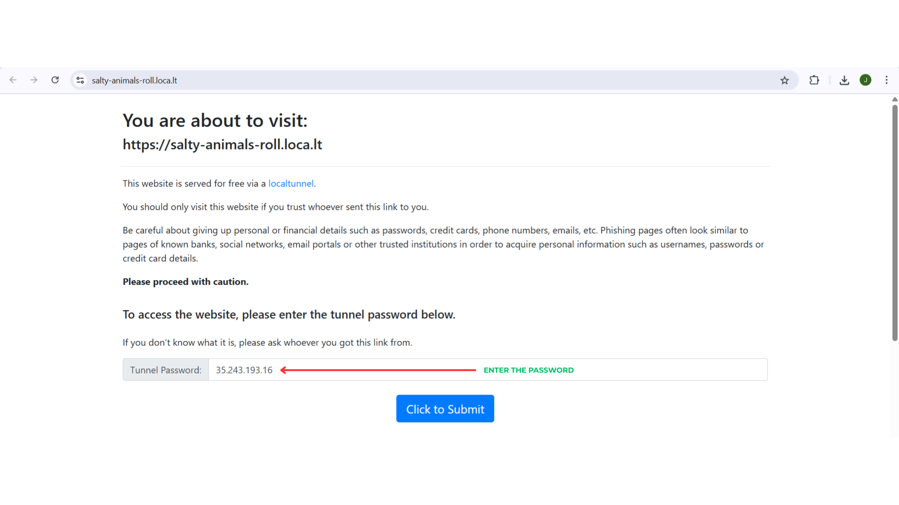

# 🧑‍💻 AI Text-to-SQL Agent (Smol Agents)

A user-friendly agent that converts natural language questions into SQL queries and executes them on your data. Built with [Hugging Face Smol Agents](https://huggingface.co/docs/smolagents/en/index) and [Streamlit](https://streamlit.io/), this app lets you upload your own CSV data or try ready-to-use demo datasets. The agent leverages LLMs to reason about your schema and generate accurate SQL queries, with results and queries shown in the UI.

## ✨ Features

- **Text-to-SQL**: Converts natural language to SQL and executes on your data
- **Upload Your Data**: Supports CSV uploads for custom queries
- **Demo Datasets**: Try with built-in example tables
- **LLM Reasoning**: Uses Smol Agents and OpenAI API
- **Streamlit UI**: Simple, interactive web interface

## 🛠️ Prerequisites

- Python 3.8+
- Sign up for an OpenAI account and generate an API key at [OpenAI API Keys](https://platform.openai.com/account/api-keys).
- Jupyter or Google Colab for running the notebook

## 📥 Installation

1. Clone the repository and navigate to this directory:
   ```bash
   git clone https://github.com/jenilsoni-ai/master-ai-agents.git
   cd master-ai-agents/smolagents/intermediate/ai-text-to-sql-agent
   ```

## 🌐 Run via Google Colab or Jupyter + Streamlit (with localtunnel)

You can run this agent in Google Colab or Jupyter and access the Streamlit UI remotely using [localtunnel](https://theboroer.github.io/localtunnel-www/). 

### Steps:
1. **Open the python notebook and run the setup cells** to install dependencies and write the Streamlit app file.
2. **Start Streamlit and localtunnel** by running the provided cell:
   ```bash
   !streamlit run /content/ai_text_to_sql_agent.py &>/content/logs.txt & npx localtunnel --port 8501 & curl ipv4.icanhazip.com
   ```
3. **Copy the password and click the localtunnel URL** from the Colab output (url will look like `https://xxxx.loca.lt`).
   
   
   *Copy the password and click the localtunnel URL from the Colab output (step 1)*

4. **Enter the copied password** You will be prompted for a password.
   
   
   *Enter the password shown in Colab output (step 2)*

5. **Use the Streamlit interface** to upload your CSV or select a demo dataset, enter your OpenAI API key, and ask questions in natural language.
   
   
   *Streamlit interface showing a sample query and result (step 3)*


## 🧠 Thought Process of the agent
- A file named `logs.txt` will be generated(in the Google Colab / Jupyter directory that is in use), which contains the complete thought process of the agent, starting from the query to the end result.

## 🧩 Frameworks & Tools Used
- [Smol Agents](https://huggingface.co/docs/smolagents/en/index)
- [Streamlit](https://streamlit.io/)
- [SQLAlchemy](https://www.sqlalchemy.org/)
- [pandas](https://pandas.pydata.org/)

## 🛠️ Troubleshooting
- **Token/Permission Errors**: Ensure your OpenAI API key is valid.

## 📚 Learn More
- [Smol Agents Documentation](https://huggingface.co/docs/smolagents/en/examples/text_to_sql)
- [Streamlit Documentation](https://docs.streamlit.io/)

---

Feel free to explore, use, and extend this agent for your own data and use cases! 